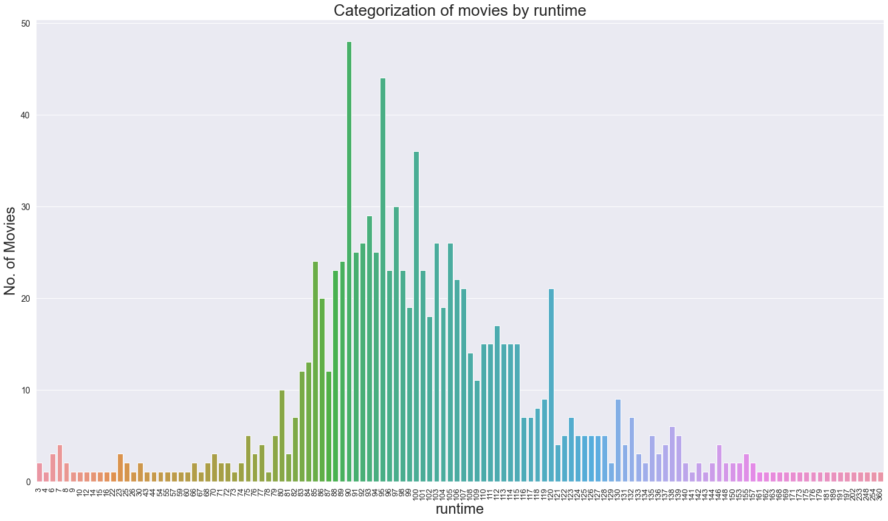
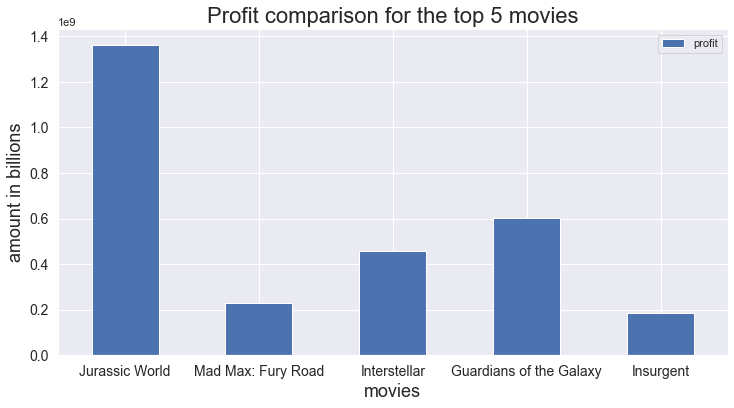
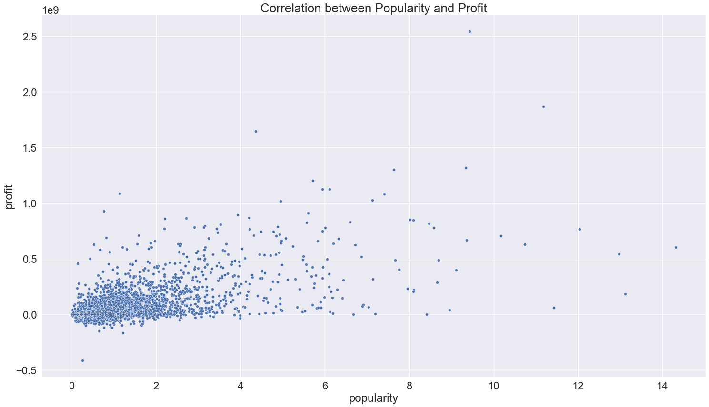

# TMDb movie data investigation
## by Kinan Jemil Hassen

## Dataset

This data set contains information about 10,000 movies collected from The Movie Database (TMDb). It includes various informations regarding the movies such as popularity, user ratings, budget, and revenue among others. The aim is to analyze the different characterisitics and find out relations between them.

The dataset can be found [here](https://www.google.com/url?q=https://d17h27t6h515a5.cloudfront.net/topher/2017/October/59dd1c4c_tmdb-movies/tmdb-movies.csv&sa=D&source=editors&ust=1668369516294937&usg=AOvVaw1VDmUpx4bN2g9l6Zd30UrC) and the detailed information regarding the dataset [here](https://www.kaggle.com/datasets/tmdb/tmdb-movie-metadata).<br>

## Questions for Analysis

The primary objective of the analysis to answer the following questions.

- What characteristics do the most popular movies have in common?
- Are popularity and profit directly proportional?
- Are there any factors influencing a movie to become less popular?
- Are the budget and runtime correlated?

## Summary of Findings

The objective was to investigate a dataset containing list of movies. Various characteristics of the movies such as budget, revenue, genre, and runtime among others were included.

Regarding the cleanliness of the data, there was some fair amount of missing data and there were input errors in the fields budget, revenue and runtime. Apart from those, there wasn't any major issue with the data.

What I've been able to deduce from the analysis is that there is a similarity in the genre of the majority of the top grossing/ popular movies. The genres "Adventure" , "Action", "Science Fiction" and "Thriller" were recurring themes through out the list of genres in the popular movies. Another observation is that most of the popular movies had been allocated a sizeable amount of budget. I've found that the mean budget allocation of the top 20 popular movies to be 145,200,000 million. Also, production companies such as "Universal studios", "Marvel Studios" and "Paramount Pictures" are associated with most of the popular movies.

Another observation concerning the popular movies is that out of the 20 most popular movies, 15 of them were made after the year 2014. This could imply that advancements in the film industry may have played a huge role in the movies becoming widely popular.

I've also been able to identify the relationship between profit and popularity where the values are directly proportional. Whenever the value of one increases the other does as well and vice versa.

About a movie becoming unpopular, I wasn't able to identify factors influencing the popularity negatively with the data at hand. Further information or extensive data maybe required to identify relationships resulting in low popularity.

Finally, the last question I tried to answer was the relationship between budget and runtime. According to my findings, budget doesn't influence the runtime of the movies. Low budget doesn't necessarily result in a movie's runtime becoming becoming short or higher budget doesn't mean the runtime of the movie will be longer.

## Limitations

- Majority of the values for "runtime" , "budget" and "revenue" are zero. This forced me into filtering the ones above zero for my analysis resulting in a smaller subset of data which could cause a hindrance in the quality of the data analysis process.

- Another issue I've found is that the unit of currency for budget and revenue hasn't been provided.

- Information regarding the popularity scale could help. The current representation is quite vague and may cause confusion.

## Key Insights from the analysis

- The runtime for the majority of the movies ranges between 80 to 120. The plot below visually depicts the runtime of the movies.



- The genres "Action", "Adventure" , "Science Fiction" & "Thriller" are the genres asscoiated with the highest grossing or popular movies. Also the movies have a pretty high budget with the mean of the top 20 popular movies being 145,200,000 million. So, higher budget may result in the movie being popular which in turn makes the movie highly profitable. Visual representation of the finding is below.



- There is a fair amount of positive correlation between profit and popularity where the values are directly proportional. Whenever the value of one increases the other does as well and vice versa.




## Resources
- [TMDB_movies_dataset](https://www.google.com/url?q=https://d17h27t6h515a5.cloudfront.net/topher/2017/October/59dd1c4c_tmdb-movies/tmdb-movies.csv&sa=D&source=editors&ust=1668369516294937&usg=AOvVaw1VDmUpx4bN2g9l6Zd30UrC)
- [Data description](https://www.kaggle.com/datasets/tmdb/tmdb-movie-metadata)

## References

- https://pandas.pydata.org/docs/user_guide/index.html#user-guide
- https://sparkbyexamples.com/pandas/pandas-change-string-object-to-date-in-dataframe/
- https://www.delftstack.com/howto/seaborn/size-of-seaborn-plot/
- https://seaborn.pydata.org/generated/seaborn.countplot.html
- https://seaborn.pydata.org/generated/seaborn.regplot.html


```python

```
